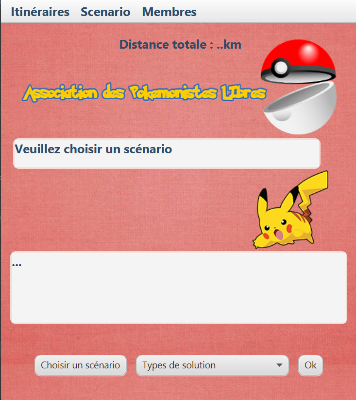
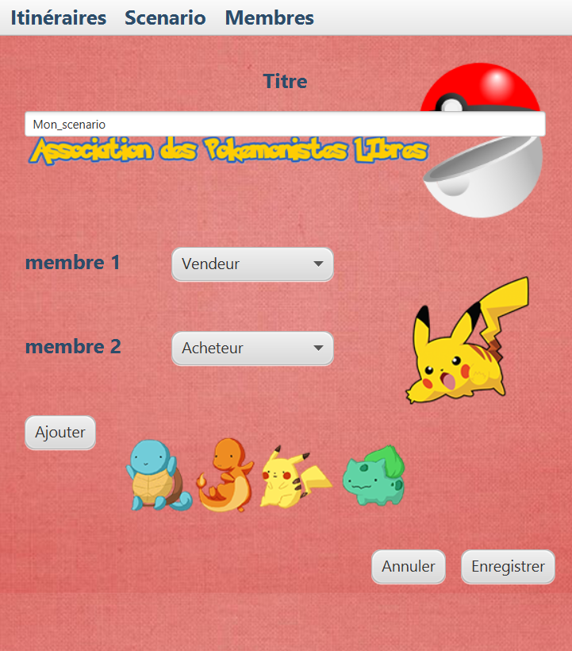
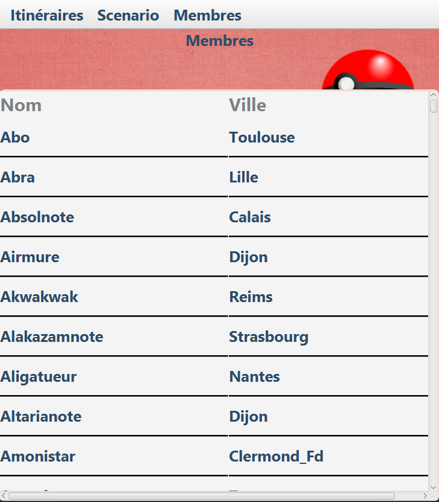

# Itinerary planning application for Pokemon group


## Introduction

"L'Association des Pokemonistes Libres" is a group of Pokemon card collectors. This application allows the director of the association to deliver Pokemon cards to its members all around France. This project was developed by me and my partner, Alexis ARAUJO, during our first year of the Computer Science Bachelor's Degree program.

## Features

- create a scenario by making a list of the different members to deliver, in .txt format.
- create an itinerary between different members in different cities, starting and ending at Vélizy (the group director's home).
- create the shortest possible itinerary.
- create all possible itineraries.
- view the group members.

## Installation

**1. Download** or **Clone** the repository on your local machine :
```bash
git clone https://github.com/SamirSubra/Itinerary-planning-application-for-Pokemon-group.git
```
**2.** **Install** JavaFX on your machine and **Configure** the libraries in your IDE, if necessary. 

**3.** **Run** the project by executing the main method in the _vue/Fenetre.java_ file.

**OR**

**Compile** with the command line :
```bash
javac --module-path "path\to\jdk\lib" --add-modules javafx.controls,javafx.fxml -cp src/main/java src/main/java/vue/Fenetre.java
```
Then **Run** the main method in the _vue/Fenetre.java_ file :
```bash
java --module-path "path\to\jdk\lib" --add-modules javafx.controls,javafx.fxml  Fenetre
```

## Usage

Select the section you want above (Itinéraires, Scenario or Membres). The scenario you create on the scenario section will be placed in Ressources folder. The scenario can be used in the Itinéraires section.

## Visual

<div style="text-align: center;">
 
 **Main page**

  

  **Scenario page**

  

  **Members page**

  
</div>
